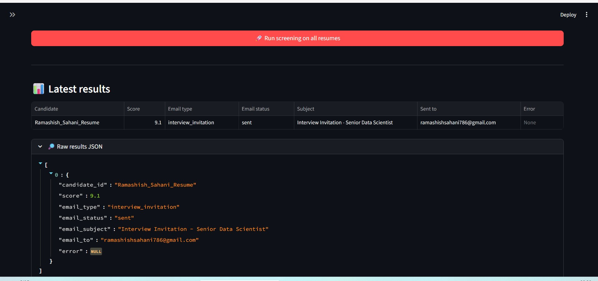
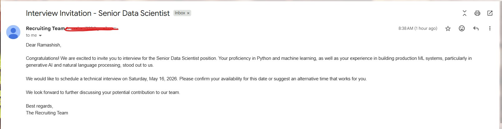

# 📄 Resume Screening Crew

A multi-agent resume screening system that reads candidate resumes, scores them against
a job description, and sends an interview invitation or polite rejection email
automatically.

Built with **CrewAI** (agent orchestration), **FastMCP** (custom tools), **FastAPI**
(backend), and **Streamlit** (frontend).

---

## What this application does

You upload one or more candidate resumes (PDF) and provide a job description. The system
runs four AI agents in sequence:

1. **Recruiter Agent** — reads the PDF, extracts the candidate's name and email, and
   produces a structured summary against three criteria (skill, years of experience,
   role alignment).
2. **Reporting Analyst** — converts the recruiter's prose summary into numeric scores
   (1–10 scale) for each criterion.
3. **Scoring Agent** — calls a weighted `grader` tool to produce one final score
   (weights: role_alignment 5, skill 3, yof 2).
4. **Send Mail Agent** — based on the final score:
   - **score ≥ 6** → sends an interview invitation with a proposed date 5 days out.
   - **score < 6** → sends a polite rejection.

Emails are sent via Gmail SMTP. A consolidated JSON file containing the summary, scores,
final score, and email result is written to `output/{resume_name}.json` for every
candidate processed.

The Streamlit UI lets you upload resumes, list and remove them (which also cleans up
their result file), edit the job description, and run the screening pipeline with
live progress updates.

---

## Project structure

```
crewai/researcher/
├── knowledge/                       # resume PDFs (managed via the UI)
├── output/                          # per-candidate consolidated JSON results
├── app.py                           # frontend (project root)
└── src/researcher/
    ├── api.py                       # FastAPI backend
    ├── crew.py                      # CrewAI crew + pydantic output schemas
    ├── main.py                      # CLI entrypoint (alternative to the UI)
    ├── config/
    │   ├── agents.yaml              # agent definitions
    │   └── tasks.yaml               # task definitions
    └── tools/
        └── custom_tool.py           # FastMCP server: grader + send_email tools
```

---

## Prerequisites

- **Python 3.10+**
- **[uv](https://docs.astral.sh/uv/)** for dependency management
- **A Gmail account with an App Password**
  - Enable 2-Step Verification on your Google account.
  - Generate an App Password at https://myaccount.google.com/apppasswords.

---

## Installation

From the project root (`crewai/researcher/`):

```bash
# 1. Create a virtual environment
uv venv

# 2. Activate it
# Windows
.venv\Scripts\activate
# macOS / Linux
source .venv/bin/activate

# 3. Install project dependencies
uv pip install -e .

# 4. Install extras needed for the backend and frontend
uv pip install fastapi "uvicorn[standard]" python-multipart streamlit requests
```

---

## Environment variables

Set these in the shell that runs the backend (or place them in a `.env` at the
project root that your tooling auto-loads):

```bash
# Required for the send_email tool
GMAIL_USER=you@gmail.com
GMAIL_APP_PASSWORD=abcdefghijklmnop

# Required by CrewAI to drive the LLM agents
OPENAI_API_KEY=sk-...
```

**Windows PowerShell:**

```powershell
$env:GMAIL_USER = "you@gmail.com"
$env:GMAIL_APP_PASSWORD = "abcdefghijklmnop"
$env:OPENAI_API_KEY = "sk-..."
```

Do **not** set `OUTPUT_DIR` or `RESUMES_DIR` unless you want to override the defaults.
The backend and CLI read/write to the same hardcoded paths (`knowledge/` and `output/`
inside the project) when these are unset.

---

## Start the backend

Open a terminal in the project root and run:

```bash
uv run uvicorn researcher.api:app --port 8000
```

Verify it's reachable:

```bash
curl http://localhost:8000/health
```

You should see paths to `knowledge/` and `output/` and `"gmail_configured": true`.

Interactive API docs are available at http://localhost:8000/docs.

---

## Start the frontend

Open a second terminal in the project root and run:

```bash
streamlit run streamlit_app.py
```

Streamlit will open at http://localhost:8501.

If your backend runs on a different host or port:

```bash
API_URL=http://localhost:8000 streamlit run streamlit_app.py
```

---

## Using the UI

1. **Sidebar** — confirms the backend is reachable and Gmail is configured.
2. **Job description** — type or paste the role you're screening for.
3. **Upload resumes** — drop one or more PDFs, click *Upload to backend*.
4. **Manage resumes** — each uploaded PDF has a *Remove* button that deletes both
   the PDF and its associated result JSON.
5. **Run screening** — set the interview-date offset (default 5 days) and keep
   *Dry run* checked while testing (it bypasses real email sending). Click *Run*.
6. **Results** — a table fills in live as each resume is processed. The raw
   consolidated JSON is available under the expander at the bottom.

---

## Alternative: command-line use

If you don't need the UI, the CLI works the same as before:

```bash
uv run crewai run
```

This runs `main.py`, which processes every PDF currently in `knowledge/`.

### Screen Shots



