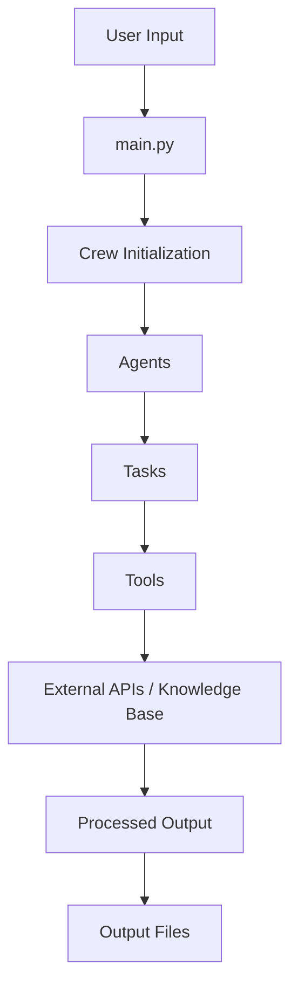
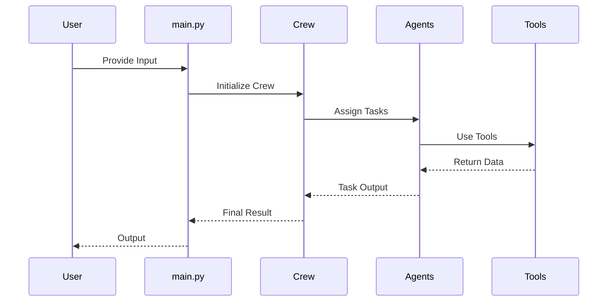

# 🚀 Researcher Crew (CrewAI Multi-Agent System)


A **modular multi-agent AI system** built using [crewAI](https://crewai.com) to automate research workflows.  
This project demonstrates how multiple AI agents collaborate using tools, memory, and structured workflows.

---

## ✨ Features

- 🤖 Multi-agent collaboration (Researcher, Writer, etc.)
- 🧠 Extensible architecture (RAG-ready)
- 🛠️ Custom tool integration
- ⚡ Fast dependency management using `uv`
- 📦 Clean, scalable project structure
- 🔌 Ready for FastMCP tool integration

---

## 🏗️ Architecture



---

## 📁 Project Structure

```bash
crewai-researcher/
├── .venv/
├── knowledge/           # Knowledge base (RAG-ready)
├── output/              # Generated outputs

├── src/
│   └── researcher/
│       ├── config/      # Agent & task configs
│       ├── tools/       # Custom tools
│       ├── crew.py      # Crew definition
│       └── main.py      # Entry point

├── .env
├── pyproject.toml
├── uv.lock
└── README.md
```

---

## ⚡ Installation

### 1. Install `uv`

```bash
pip install uv
```

---

### 2. Setup Environment

```bash
uv venv
```

Activate:

**Windows**
```bash
.venv\Scripts\activate
```

**Mac/Linux**
```bash
source .venv/bin/activate
```

---

### 3. Install Dependencies

```bash
uv pip install -e .
```

---

## 🔑 Environment Variables

Create a `.env` file:

```env
OPENAI_API_KEY=your_api_key_here
```

---

## ▶️ Running the Project

```bash
uv run crewai run
```
---

## 🧠 How It Works

1. `main.py` initializes the crew  
2. `crew.py` defines agents and workflows  
3. Agents execute tasks defined in `config/`  
4. Tools fetch/process external data  
5. Final output is stored in `output/`  

---

## 🔄 Agent Workflow



---

## 🧪 Testing

```bash
python test.py
```

---

## ⚙️ FastMCP Integration (Optional)

Inspect tools:

```bash
uv run fastmcp dev inspector custom_tool.py
```

Run MCP server:

```bash
uv run fastmcp run custom_tool.py
```

---

## 🚀 Future Improvements

- 🔍 Add full RAG pipeline (vector DB)
- 🌐 API deployment (FastAPI)
- 📊 Monitoring & logging (Langfuse / OpenTelemetry)
- 🧠 Memory-enabled agents
- ☁️ Cloud deployment (AWS / Azure)

---

## 🤝 Contributing

Feel free to fork this repo and extend it with:
- New agents  
- Better tools  
- Improved workflows  

---

## 📚 Resources

- CrewAI Docs: https://docs.crewai.com  
- UV Docs: https://docs.astral.sh/uv/  

---

## ⭐ Final Note

This project is part of my journey to **master AI Engineering & Multi-Agent Systems**.  
If you find it useful, consider giving it a ⭐